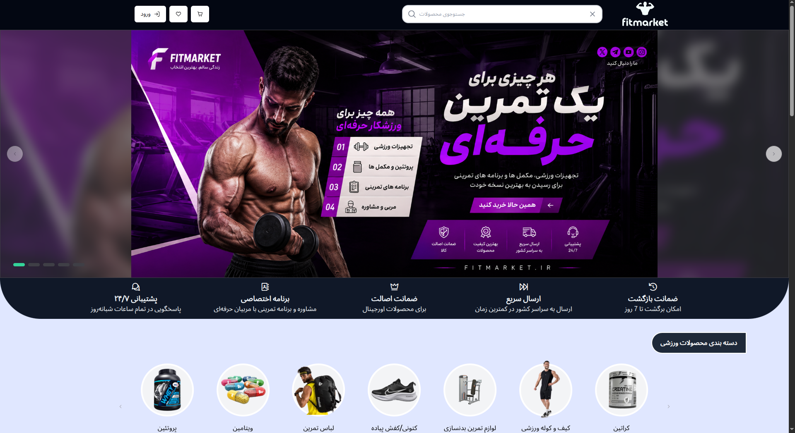
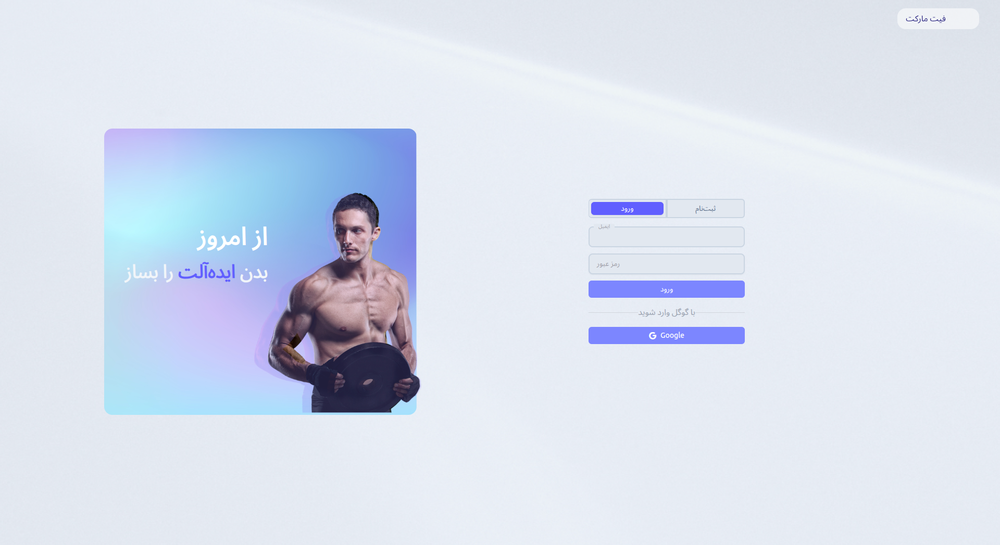
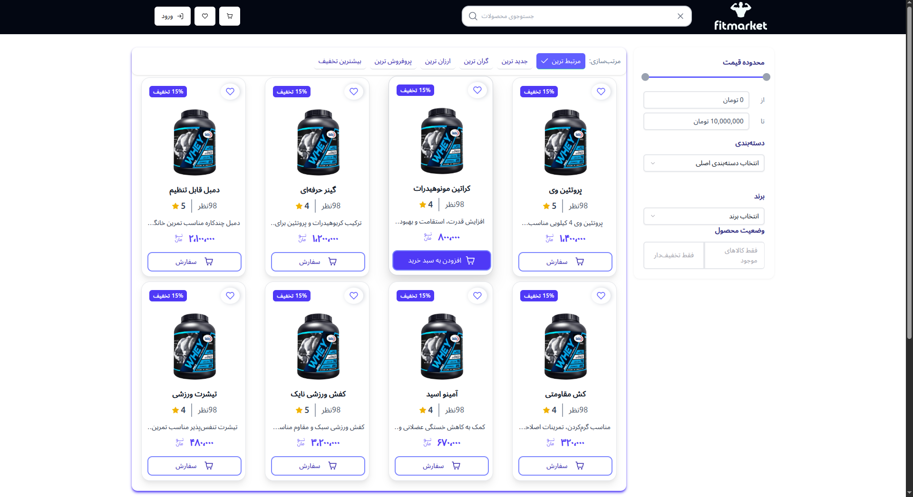
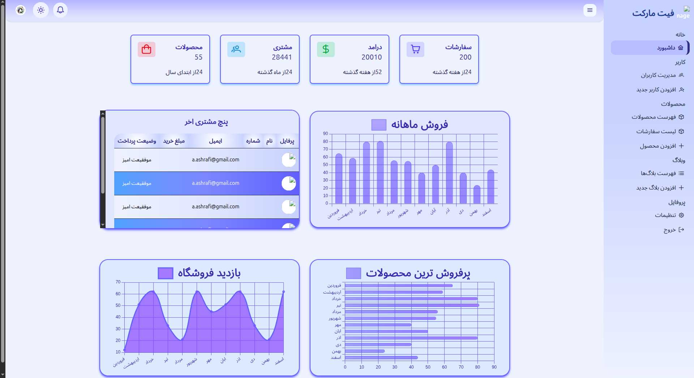
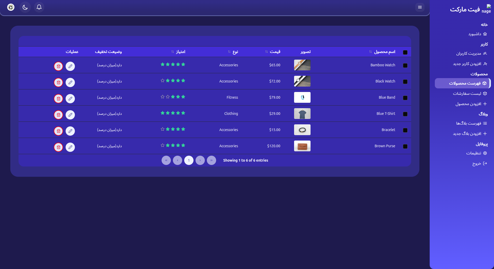

# FitMarket

فروشگاه آنلاین محصولات ورزشی و فیتنس — یک پروژه Full-Stack که با Angular و NestJS در حال توسعه است.

> ⚠️ **این پروژه هنوز در حال توسعه است** و بخش‌های زیادی از آن تکمیل نشده‌اند.

## تکنولوژی‌ها

**Frontend**
- Angular 22
- TypeScript
- RxJS
- Tailwind CSS
- PrimeNG

**Backend**
- NestJS
- MongoDB

## وضعیت فعلی پروژه

- ✅ بخش احراز هویت (Authentication) پیاده‌سازی و کار می‌کند
- 🚧 بخش فروشگاه (Front) از نظر ظاهری طراحی شده اما هنوز داینامیک نیست
- 🚧 پنل ادمین از نظر ظاهری طراحی شده اما هنوز داینامیک نیست

### امکانات پیاده‌سازی‌شده در احراز هویت
- Login
- Register
- Logout
- Route Guard
- Role-based Access
- Token / JWT
- LocalStorage
- SessionStorage
- Refresh Token

## نحوه اجرای پروژه

برای اجرای پروژه سه دستور زیر باید به صورت جداگانه اجرا شوند:

```bash
# اجرای فرانت‌اند
npm start

# اجرای بک‌اند
npm run start:dev

# اجرای دیتابیس (MongoDB با Docker)
sudo docker start mongodb
```

## اطلاعات ورود ادمین

برای تست بخش ادمین می‌توانید از اطلاعات زیر استفاده کنید:

| فیلد | مقدار |
|---|---|
| Email | admin@test.com |
| Password | 123456 |

## نقشه راه (بخش‌های باقی‌مانده)

- [ ] داینامیک کردن بخش فروشگاه (اتصال به بک‌اند)
- [ ] داینامیک کردن پنل ادمین
- [ ] تکمیل سایر امکانات پروژه
## اسکرین‌شات‌ها

### صفحه اصلی


### صفحه محصولات


### ورود


### پنل ادمین

